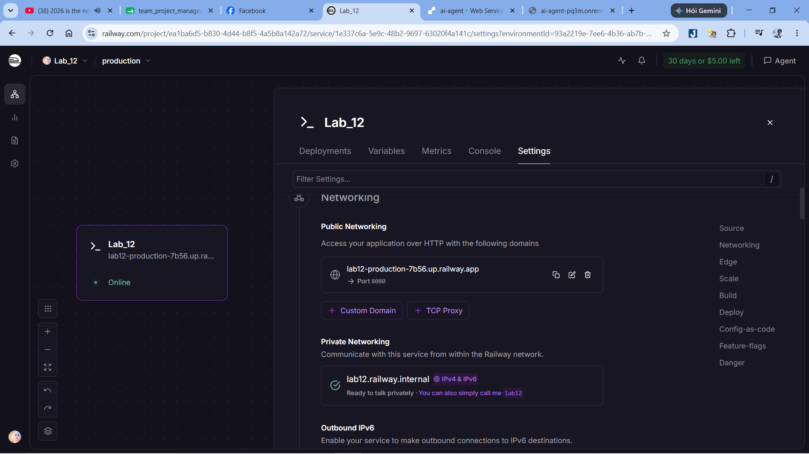

# Day 12 Lab - Mission Answers

## Part 1: Localhost vs Production

### Exercise 1.1: Anti-patterns found

1. API key hoặc secret bị hardcode trực tiếp trong source code, điều này nguy hiểm vì secret có thể bị lộ khi push code lên GitHub.
2. Port được hardcode cố định, ví dụ `8000`, làm app kém linh hoạt khi deploy lên cloud platform.
3. Debug mode/reload được bật trong môi trường develop, phù hợp khi chạy local nhưng không an toàn cho production.
4. App bind vào `localhost`, trong khi khi chạy Docker hoặc cloud cần bind vào `0.0.0.0`.
5. Không có health check endpoint đầy đủ để platform biết app còn sống hay không.
6. Không xử lý graceful shutdown, nên khi container bị stop/restart có thể làm gián đoạn request.
7. Logging còn đơn giản, chủ yếu dùng `print()`, khó quan sát và debug trong production.

### Exercise 1.3: Comparison table

| Feature              | Develop                          | Production                                          | Why Important?                                                                   |
| -------------------- | -------------------------------- | --------------------------------------------------- | -------------------------------------------------------------------------------- |
| Config               | Hardcode trong code              | Đọc từ environment variables hoặc `.env`            | Giúp app dễ đổi cấu hình giữa local, staging và production mà không cần sửa code |
| Secrets              | Có thể viết trực tiếp trong code | Đưa ra ngoài code bằng env vars hoặc secret manager | Tránh làm lộ API key/credential khi push code                                    |
| Port                 | Cố định, ví dụ `8000`            | Đọc từ biến môi trường `PORT`                       | Cloud platform thường cấp port động                                              |
| Host                 | `localhost`                      | `0.0.0.0`                                           | Cần thiết để container/cloud nhận traffic từ bên ngoài                           |
| Debug mode           | Bật để tiện develop              | Tắt trong production                                | Tránh lộ thông tin lỗi nội bộ và tăng độ ổn định                                 |
| Health check         | Thiếu hoặc chưa đầy đủ           | Có `/health`                                        | Platform dùng để kiểm tra app còn sống                                           |
| Readiness check      | Không có hoặc chưa rõ ràng       | Có `/ready`                                         | Cho biết app đã sẵn sàng nhận request thật hay chưa                              |
| Logging              | Dùng `print()`                   | Structured logging / logging rõ ràng hơn            | Dễ debug, monitor và đọc log trong production                                    |
| Shutdown             | Dừng đột ngột                    | Graceful shutdown                                   | Giúp app hoàn thành request đang xử lý trước khi tắt                             |
| Production readiness | Chỉ phù hợp chạy local           | Phù hợp hơn để deploy Docker/cloud                  | Giảm lỗi “works on my machine”                                                   |

## Part 2: Docker

### Exercise 2.1: Dockerfile questions

1. Base image: Base image ban đầu là `python:3.11`. Trong quá trình làm lab, tôi đổi sang `mirror.gcr.io/library/python:3.11-slim` để tránh lỗi Docker Hub timeout và làm image nhẹ hơn.
2. Working directory: Working directory là `/app`, được khai báo bằng `WORKDIR /app`. Đây là thư mục chính bên trong container nơi app và dependencies được đặt.
3. Why copy `requirements.txt` before source code: Copy `requirements.txt` trước giúp Docker cache layer cài dependencies. Nếu chỉ sửa code mà không sửa dependencies, Docker không cần chạy lại bước `pip install`, giúp build nhanh hơn.
4. CMD vs ENTRYPOINT: `CMD` là lệnh mặc định chạy khi container start và có thể dễ dàng override khi chạy `docker run`. `ENTRYPOINT` cố định hơn, thường dùng khi container luôn phải chạy một executable chính. Trong lab này dùng `CMD` để chạy app Python/FastAPI.

### Exercise 2.3: Image size comparison

* Develop: `[FILL_DEVELOP_IMAGE_SIZE]` MB
* Production: `[FILL_PRODUCTION_IMAGE_SIZE]` MB
* Difference: `[FILL_DIFFERENCE_PERCENT]`%

Formula:

```text
Difference % = ((Develop size - Production size) / Develop size) * 100
```

Production image thường nhỏ hơn hoặc tối ưu hơn vì dùng production Dockerfile/multi-stage build. Trong quá trình làm lab, tôi cũng đổi base image sang bản `python:3.11-slim` qua mirror để giảm dung lượng và tránh lỗi pull từ Docker Hub.

## Part 3: Cloud Deployment

### Exercise 3.1: Railway deployment

* URL: `[lab12-production-7b56.up.railway.app]`
* Screenshot: 

Tôi đã deploy app lên Railway bằng các bước chính sau:

1. Chạy local app trong thư mục `03-cloud-deployment/railway`.
2. Cài Railway CLI.
3. Đăng nhập bằng `railway login`.
4. Tạo/link project bằng `railway init`.
5. Deploy bằng `railway up`.
6. Lấy public URL bằng Railway domain.
7. Test public URL với endpoint `/health` và `/ask`.

Railway deployment hoạt động vì app bind vào `0.0.0.0`, dùng biến môi trường `PORT`, và có health check endpoint `/health`.


## Part 4: API Security

### Exercise 4.1: API Key authentication

Trong `04-api-gateway/develop/app.py`, API key được kiểm tra trong dependency `verify_api_key()`.
Endpoint `/ask` khai báo `_key: str = Depends(verify_api_key)`, nên request phải đi qua bước kiểm tra header `X-API-Key` trước khi agent xử lý câu hỏi.

Kết quả theo logic code:

| Case | Result |
| ---- | ------ |
| Không gửi `X-API-Key` | `401 Missing API key` |
| Gửi sai key | `403 Invalid API key` |
| Gửi đúng key | `200`, agent trả lời câu hỏi |

Cách rotate key: đổi biến môi trường `AGENT_API_KEY` trên môi trường deploy rồi restart/redeploy service. Trong production thực tế nên hỗ trợ nhiều key tạm thời để rotate không làm gián đoạn client cũ.

### Exercise 4.2: JWT authentication

Trong `04-api-gateway/production/auth.py`, JWT flow hoạt động như sau:

1. Client gọi `POST /auth/token` với username/password.
2. `authenticate_user()` kiểm tra credential trong `DEMO_USERS`.
3. `create_token()` tạo JWT bằng thuật toán `HS256`, chứa `sub`, `role`, `iat`, `exp`.
4. Client gửi token qua header `Authorization: Bearer <token>`.
5. `verify_token()` decode token, kiểm tra chữ ký và hạn dùng.
6. Endpoint `/ask`, `/me/usage`, `/admin/stats` chỉ chạy nếu token hợp lệ.

Nếu token hết hạn, API trả `401 Token expired`. Nếu token sai hoặc bị sửa, API trả `403 Invalid token`.

### Exercise 4.3: Rate limiting

`04-api-gateway/production/rate_limiter.py` dùng thuật toán **Sliding Window Counter** bằng `deque` timestamps theo từng user.

| Role | Limit |
| ---- | ----- |
| user/student | 10 requests/phút |
| admin/teacher | 100 requests/phút |

Admin không bypass hoàn toàn, nhưng được cấp quota cao hơn bằng cách chọn `rate_limiter_admin` khi `role == "admin"` trong `app.py`. Khi vượt limit, API trả `429 Rate limit exceeded` kèm header `Retry-After`.

Các lệnh curl/runtime test được skip theo yêu cầu vì cần chạy server ngoài nội dung chỉnh sửa trong VS Code. Code path đã được kiểm tra bằng cách đọc dependency flow trong `app.py`.

### Exercise 4.4: Cost guard implementation

Tôi đã bổ sung hàm `check_budget(user_id: str, estimated_cost: float) -> bool` trong `04-api-gateway/production/cost_guard.py` theo đúng yêu cầu CODE_LAB:

- Mỗi user có budget `$10/tháng`.
- Key Redis có dạng `budget:{user_id}:{YYYY-MM}`.
- Trước khi ghi usage, hàm đọc current spending.
- Nếu `current + estimated_cost > 10`, trả `False`.
- Nếu còn budget, tăng spending bằng `incrbyfloat()` và set TTL `32 ngày` để tự reset sau tháng đó.
- Nếu Redis chưa bật khi demo local, code fallback sang in-memory để app vẫn chạy.

File `04-api-gateway/production/requirements.txt` cũng đã thêm `redis==5.1.0`.

## Part 5: Scaling & Reliability

### Exercise 5.1-5.5: Implementation notes

### Exercise 5.1: Health checks

`05-scaling-reliability/develop/app.py` đã có:

- `GET /health`: liveness probe, trả status, uptime, version, environment, timestamp và memory check nếu có `psutil`.
- `GET /ready`: readiness probe, trả `503` nếu agent chưa sẵn sàng hoặc đang shutdown; trả `200` khi `_is_ready == True`.

Health check giúp platform biết container còn sống không. Readiness check giúp load balancer biết instance đã sẵn sàng nhận traffic chưa.

### Exercise 5.2: Graceful shutdown

Graceful shutdown được implement bằng FastAPI lifespan:

- Startup set `_is_ready = True`.
- Shutdown set `_is_ready = False`.
- App đợi request đang xử lý hoàn thành, tối đa `30 giây`.
- `SIGTERM` và `SIGINT` được catch để log, còn Uvicorn xử lý shutdown lifecycle.

Điều này giúp container không bị tắt đột ngột khi còn request đang chạy.

### Exercise 5.3: Stateless design

`05-scaling-reliability/production/app.py` lưu session/conversation history trong Redis qua các hàm:

- `save_session()`
- `load_session()`
- `append_to_history()`

State không còn phụ thuộc vào memory riêng của từng instance. Khi scale lên nhiều container, request của cùng một user có thể đi tới instance khác nhưng vẫn đọc được history từ Redis.

### Exercise 5.4: Load balancing

`05-scaling-reliability/production/docker-compose.yml` đã được sửa để build đúng từ `05-scaling-reliability/production/Dockerfile`. Stack gồm:

- `agent`: FastAPI app, có thể scale lên nhiều replicas.
- `redis`: shared session storage.
- `nginx`: load balancer, route traffic tới `agent:8000`.

Tôi cũng thêm endpoint alias `POST /ask` để khớp với câu lệnh curl trong CODE_LAB; endpoint này dùng lại logic stateless của `/chat`.

### Exercise 5.5: Test stateless

`test_stateless.py` kiểm tra luồng:

1. Tạo session mới.
2. Gửi nhiều câu hỏi liên tiếp.
3. Quan sát `served_by` để thấy request có thể được phục vụ bởi nhiều instance.
4. Gọi history để xác nhận conversation vẫn còn.

Các thao tác chạy Docker/server thực tế được skip theo yêu cầu vì nằm ngoài phần chỉnh sửa trong VS Code. Phần code và compose đã được hoàn thiện để có thể chạy bằng:

```bash
cd 05-scaling-reliability/production
docker compose up --scale agent=3
python test_stateless.py
```

## Part 6: Final Project

### Implementation summary

Final project trong `06-lab-complete` đã được hoàn thiện theo requirements của CODE_LAB:

| Requirement | Implementation |
| ----------- | -------------- |
| REST API trả lời câu hỏi | `POST /ask` trong `app/main.py` |
| Conversation history | Redis list `history:{user_id}`, fallback memory khi demo local |
| Config từ env vars | `app/config.py` |
| API key auth | `app/auth.py` |
| Rate limiting 10 req/min | `app/rate_limiter.py`, sliding window |
| Cost guard $10/month/user | `app/cost_guard.py`, Redis hash theo tháng |
| Health check | `GET /health` |
| Readiness check | `GET /ready`, kiểm tra Redis khi có `REDIS_URL` |
| Graceful shutdown | `SIGTERM` handler + Uvicorn graceful timeout |
| Structured logging | JSON log bằng `json.dumps()` |
| Dockerized | Multi-stage `Dockerfile` |
| Scaling/load balancing | `docker-compose.yml` có `agent`, `redis`, `nginx` |
| Deploy config | `railway.toml` và `render.yaml` |

### Files completed

- `06-lab-complete/app/auth.py`
- `06-lab-complete/app/rate_limiter.py`
- `06-lab-complete/app/cost_guard.py`
- `06-lab-complete/app/main.py`
- `06-lab-complete/utils/mock_llm.py`
- `06-lab-complete/nginx.conf`
- `06-lab-complete/docker-compose.yml`
- `06-lab-complete/.env.example`
- `06-lab-complete/README.md`

### Local run command

```bash
cd 06-lab-complete
docker compose up --scale agent=3
curl http://localhost/health
curl -H "X-API-Key: secret" http://localhost/ask \
  -X POST \
  -H "Content-Type: application/json" \
  -d '{"question": "Hello", "user_id": "user1"}'
```

Runtime Docker/deployment commands were skipped as requested. The repository-side implementation is complete and ready for local validation when needed.
